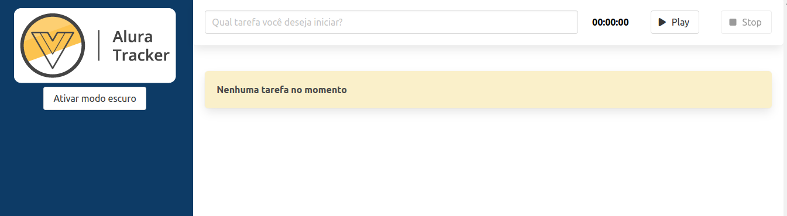
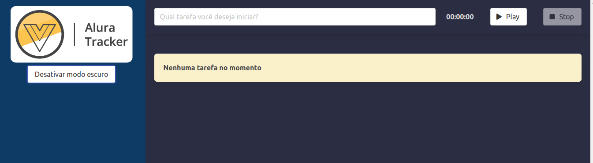
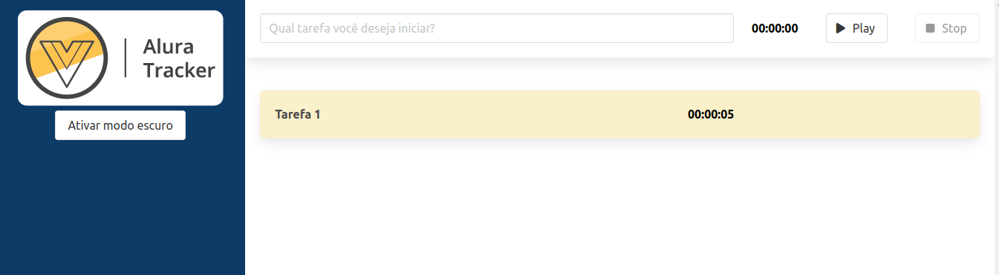
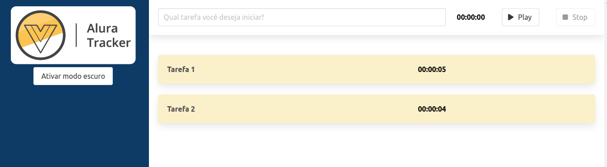

# Alura Tracker
Projeto Alura Tracker desenvolvido no curso de Vue JS na Alura. Essa aplicação tem a responsabilidade por fazer o tracking, o acompanhamento de tarefas diárias que executamos diariamente. Ao iniciar uma tarefa, o cronômetro vai começar a correr e quando finalizar ele vai começar a preencher uma lista.

## Imagens da Aplicação

### Página Inicial



### Adicionar Tarefas
Para adicionar uma tarefa, você coloca o título e depois clica no botão "Play". O cronômetro vai iniciar, e assim que você terminar a tarefa, clica no botão "Stop". A tarefa vai ser adicionada em uma lista de tarefas que vai ser exibida na tela.




## Configuração do Projeto
```bash
npm install
```

### Compilar e Recarregar Automaticamente em Ambiente de Desenvolvimento
```bash
npm run serve
```

### Compilar e Minificar Arquivos em Ambiente de Produção
```bash
npm run build
```

### Lints e Corrigir Arquivos
```bash
npm run lint
```

### Configurações Customizadas
Veja mais sobre na [documentação oficial do framework](https://cli.vuejs.org/config/).
